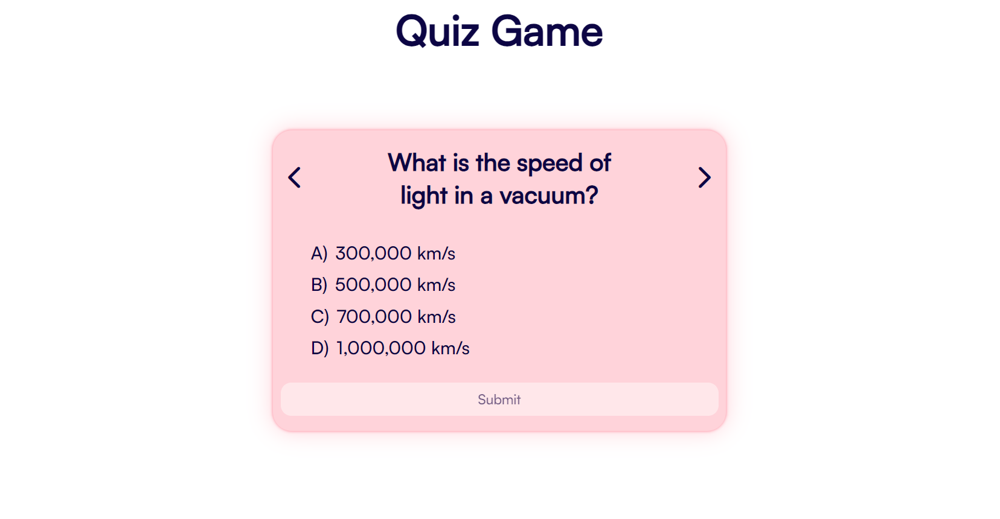

# Quiz Game with jQuery

## Tools
Made using **jQuery** and **Django** with **Python**. Django backend contains a simple endpoint containing all the questions frontend needs to get.

Frontend requests for the data from backend when the "Click to start" button is clicked by the user.

## Runing on Local
Simply install the project, and change the api in frontend to `http://localhost:8000`.
And in the backend add `http://localhost:5500` in my case since I use Live Server extensions, mught be different for you. 